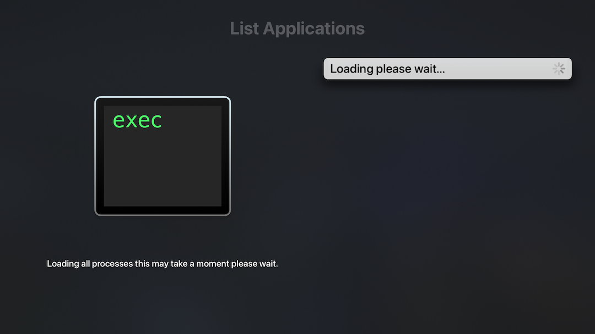
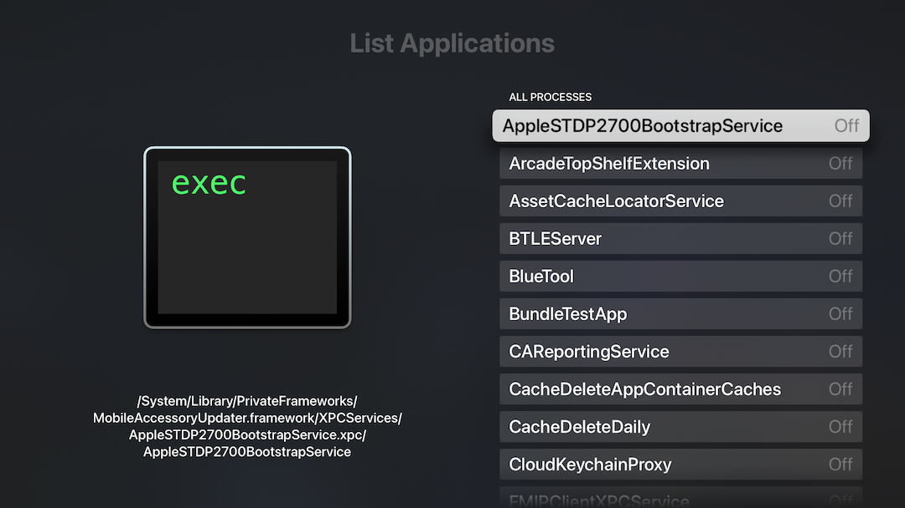
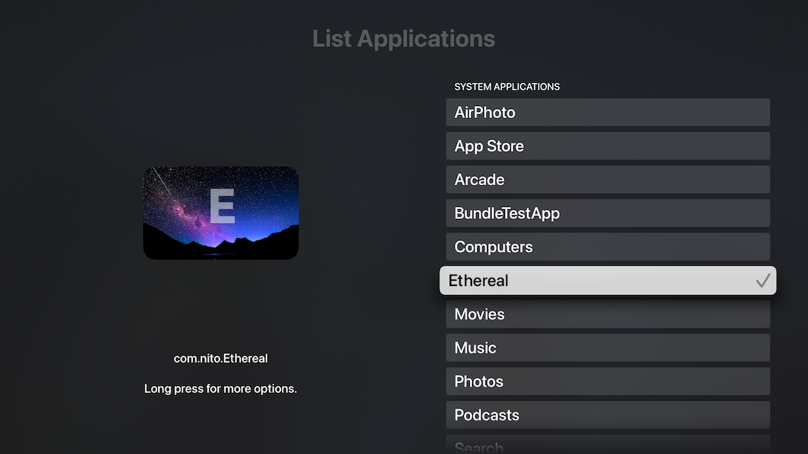

# BundleTestAppListTV

Use [applist](https://github.com/lechium/AppListTV) to create an application on jailbroken tvOS.




The bulk of the code is handled in AppDelegate

```Objective-C

#import <TVSettingKit/_TSKSplitViewController.h>

@interface AppDelegate ()
@property _TSKSplitViewController *rootViewController;
@end
@interface UIViewController (specifier) //is actually added to a different class we inherit from, this is just a lazy hack to make it build.
-(NSDictionary *)specifier;
- (void)setSpecifier:(NSDictionary *)spec;
@end
@implementation AppDelegate

- (BOOL)application:(UIApplication *)application didFinishLaunchingWithOptions:(NSDictionary *)launchOptions {
    // Override point for customization after application launch.
    _window = [[UIWindow alloc] initWithFrame:[UIScreen mainScreen].bounds];
    NSBundle *bundle = [NSBundle bundleWithPath:@"/System/Library/PreferenceBundles/AppList.bundle"];
    [bundle load];
    if ([bundle isLoaded]) {
        UIViewController *ourVC = [bundle.principalClass new];
        NSDictionary *spec = @{@"ALAllowsSelection": @"1",
                               @"ALSettingsDefaultValue": @0,
                               @"ALSettingsKeyPrefix": @"SPL",
                               @"ALSettingsPath": @"/var/mobile/Library/Preferences/com.sample.allproc.plist",
                               @"ALSingleEnabledMode": (id)kCFBooleanFalse, 
                               @"ALAllProcessesMode": (id)kCFBooleanTrue,
                               @"isController": (id)kCFBooleanTrue,
                               @"label": @"List Applications"};
                            
        [ourVC setSpecifier:spec];
        
        //a few changes above can drastically change the application
        //ALSettingsKeyPrefix -> ALSettingsKey + ALSingleEnabledMode -> true will give the single selection appearance.
        //ALAllProcessesMode -> kCFBooleanFalse - normal application listing.
        
        UINavigationController *navController = [[UINavigationController alloc] initWithRootViewController:ourVC];
            _rootViewController = [[_TSKSplitViewController alloc] initWithNavigationController:navController];
    } else {
            UIViewController *blank = [[UIViewController alloc] init];
            UINavigationController *navController = [[UINavigationController alloc] initWithRootViewController:blank];
            _rootViewController = [[_TSKSplitViewController alloc] initWithNavigationController:navController];
    }
    _window.rootViewController = _rootViewController;
    [_window makeKeyAndVisible];
    return YES;
}
```

few minor changes:

```Objective-C
     NSDictionary *spec = @{@"ALAllowsSelection": @"1",
                            @"ALSettingsDefaultValue": @0,
                            @"ALSettingsPrefix": @"isEnabled",
                            @"ALSettingsPath": @"/var/mobile/Library/Preferences/com.sample.single.plist",
                            @"ALSingleEnabledMode": (id)kCFBooleanTrue, 
                            @"ALAllProcessesMode": (id)kCFBooleanFalse,
                            @"isController": (id)kCFBooleanTrue,
                            @"label": @"List Applications"};
```

would yield:


